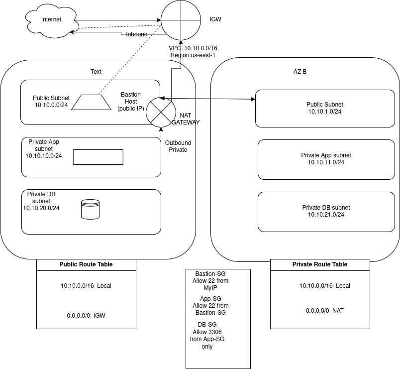

# AWS Private Web Server Architecture Lab

This project simulates a production-style AWS network architecture
with secure access to private infrastructure.

## Architecture

Internet
   ↓
Internet Gateway
   ↓
Public Subnet
   ↓
Bastion Host
   ↓
Private Subnet
   ↓
EC2 Web Server (Nginx)
